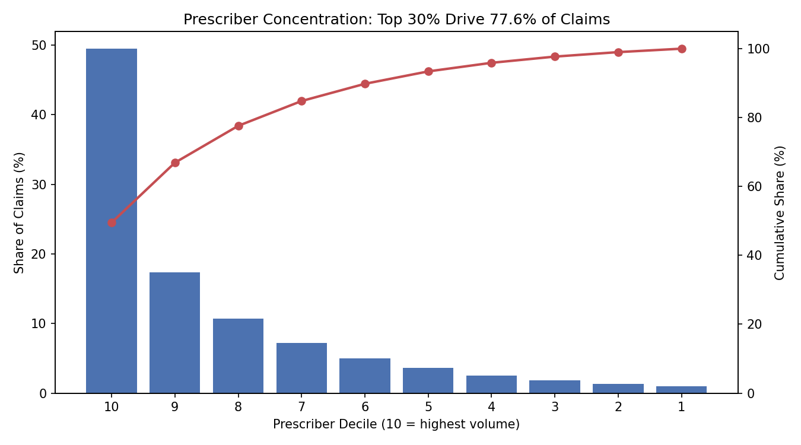

# 💊 Pharma Brand Launch Analytics

> **An end-to-end commercial analytics suite for a pharmaceutical brand launch — built on 511K rows of real CMS Medicare Part D data.**
>
> Segment 282,123 prescribers → size a 484-rep salesforce → design territories → model incentive compensation. The exact workflow a life-sciences commercial analytics team runs before a launch.

<p align="center">
  
  
  
  
  
</p>

---

## 📋 Table of Contents
- [The Business Problem](#-the-business-problem)
- [Data](#-data)
- [Key Findings](#-key-findings)
- [The Analytics Pipeline](#-the-analytics-pipeline)
- [Tech Stack](#-tech-stack)
- [Repository Structure](#-repository-structure)
- [How to Run](#-how-to-run)

---

## 🎯 The Business Problem

**Corvana Therapeutics** *(fictional client)* is launching **Carddil (fluxaban)**, a novel oral factor Xa inhibitor, into the US anticoagulant market — an established, crowded category where **Eliquis** and **Xarelto** displaced the 60-year incumbent **warfarin**.

Entering late into a competitive market, success depends entirely on **commercial execution**. The VP of Commercial Operations needs three questions answered:

| # | Question | Deliverable |
|---|----------|-------------|
| 1 | **Whom do we target?** | Prescriber segmentation → target universe |
| 2 | **How do we cover them?** | Salesforce sizing + call planning + territories |
| 3 | **How do we pay them?** | Incentive compensation design |

This project answers all three, end to end.

---

## 📊 Data

| | |
|---|---|
| **Source** | [CMS Medicare Part D Prescribers — by Provider and Drug](https://data.cms.gov) (real, public, API) |
| **Competitive set** | Eliquis · Xarelto · Warfarin Sodium · Pradaxa · Savaysa · Jantoven |
| **Volume** | 511,302 prescriber–drug rows → **282,123 unique prescribers** |

**Real market layer, simulated commercial layer.**
The prescriber and prescribing data is **100% real CMS data**. The commercial constructs (rep calls, sales goals, territory attainment, payouts) are **simulated with documented assumptions**, because that data is client-confidential at every pharma company — the same way consulting firms build test environments.

> **Known limitation (and why it's acceptable):** Part D covers only the 65+ Medicare population. This is ideal for anticoagulants — atrial fibrillation is overwhelmingly a senior condition, so the data captures a representative slice of the real market.

---

## 💡 Key Findings

### The core insight: extreme prescriber concentration

<p align="center">
  
</p>

- 🔵 **The top decile alone drives 49.5% of all claims.**
- 🔴 **The top 3 deciles (just 30% of prescribers) drive 77.6%.**
- ⚖️ A top-decile prescriber is worth **~50× a bottom-decile one** — yet both cost a rep the same hour to visit.

**This concentration is the entire justification for targeting.** Instead of chasing 282K prescribers, a salesforce covering ~30% of them addresses over three-quarters of the market.

### Other findings

| Area | Finding |
|------|---------|
| **Market value** | Eliquis ≈ **$19.9B** vs Xarelto $5.4B; warfarin's ~105K prescribers contribute almost nothing in $ → **warfarin conversion is the cleanest revenue opportunity** |
| **Specialty mix** | Primary care out-prescribes cardiology even in the elite tier, but cardiology is *denser* → supports a **dual salesforce** (specialist + high-decile PCP) |
| **Salesforce size** | 84,637 targets × tiered call frequency (12/8/4) = 677K calls → **484 reps (~$121M budget)** |
| **Territory design** | Largest-remainder allocation reconciles rounding drift back to exactly 484 reps |
| **Incentive comp** | Threshold-accelerator runs **4.9% under budget**; flags **17% of territories** at zero payout as a fairness risk |

---

## 🔧 The Analytics Pipeline

```
CMS Part D API
      |  511K rows, 6 drugs
      v
 01 EXTRACT  ->  02 CLEAN     ->  03 EXPLORE      ->  04 SEGMENT
 CMS API         drop GE65        market insights     decile HCPs
                                                          |
      +---------------------------------------------------+
      v
 05 TARGET & ->  06 TERRITORY ->  07 SIMULATE     ->  08 INCENTIVE
 SIZE (484)      largest-rem      goals + attain      payout curves
                                                          |
                                                          v
                                          09/10 DASHBOARD + VIZ
                                          Power BI . matplotlib
```

### Incentive compensation: three curves compared

| Curve | Total Payout | vs $19.64M Target Budget |
|-------|-------------:|:------------------------:|
| Linear | $19.74M | +0.5% |
| **Threshold-Accelerator** ✅ | **$18.68M** | **−4.9%** |
| Capped Accelerator | $18.68M | −4.9% |

**Recommendation:** adopt the **threshold-accelerator** — pays nothing below 80% attainment (budget protection), rewards overperformance at 2× above goal, and lands 4.9% under budget.
**Fairness flag:** the 80% threshold zeroes out **10 of 59 territories (17%)** — likely too punitive for a launch year with unvalidated goals. Mitigation: lower the threshold to 70% or add a partial-payout band.

---

## 🛠 Tech Stack

| Layer | Tools |
|-------|-------|
| **Pipeline & analysis** | Python · pandas · numpy |
| **Simulation** | numpy (seeded, documented assumptions) |
| **Visualization** | matplotlib · **Power BI** (executive dashboard) |
| **Data source** | CMS Open Data API |

---

## 📁 Repository Structure

```
pharma-launch-analytics/
|-- scripts/
|   |-- 01pull_data.py        # CMS API extraction (511K rows)
|   |-- 02clean_data.py       # cleaning . GE65 drop . dedup
|   |-- 03explore_data.py     # market & specialty insights
|   |-- 04segment_data.py     # collapse to prescribers . decile
|   |-- 05target_sizing.py    # target universe . salesforce sizing
|   |-- 06territory.py        # territory allocation (largest-remainder)
|   |-- 07simulate.py         # synthetic commercial layer
|   |-- 08incentive.py        # IC payout curves
|   |-- 09dashboard_data.py   # dashboard data exports
|   +-- 10charts.py           # concentration curve
|-- charts/                   # generated visuals
|-- data/dashboard/           # dashboard-ready CSVs
|-- notes.md                  # decision log
+-- README.md
```


---

## ▶️ How to Run

```bash
# 1. install dependencies
pip install pandas numpy matplotlib requests

# 2. run the pipeline in order (each script consumes the previous output)
python scripts/01pull_data.py      # pulls raw data from the CMS API
python scripts/02clean_data.py
python scripts/03explore_data.py
python scripts/04segment_data.py
python scripts/05target_sizing.py
python scripts/06territory.py
python scripts/07simulate.py
python scripts/08incentive.py
python scripts/09dashboard_data.py
python scripts/10charts.py
```

The scripts form a **dependency chain** — a reproducible, ordered pipeline from raw CMS data to launch-ready recommendations.

---

<p align="center"><i>Built as a portfolio project demonstrating end-to-end pharma commercial analytics — from raw claims data to boardroom recommendation.</i></p>
